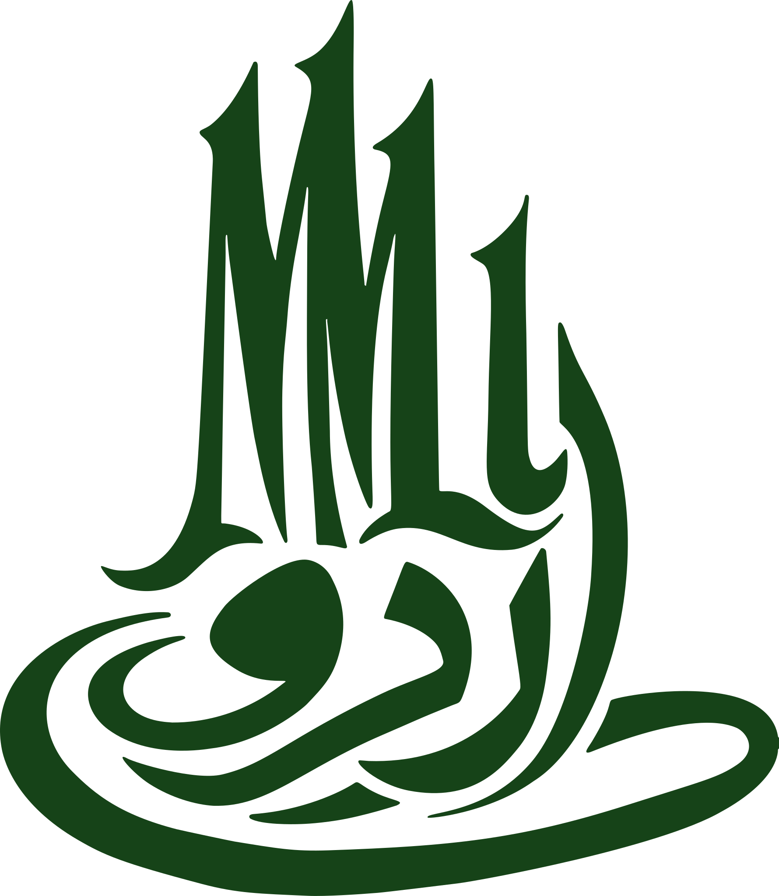

<p align="center">
  
</p>

<h1 align="center">UrduMMLU</h1>

<h3 align="center">A Massive Multitask Benchmark for Urdu Language Understanding</h3>

<p align="center">
  <a href="https://huggingface.co/datasets/MBZUAI/UrduMMLU"></a>
  <a href="https://arxiv.org/abs/2606.07167"></a>
  <a href="https://mbzuai-nlp.github.io/UrduMMLU/"></a>
  
  
  <br>
  <a href="LICENSE"></a>
  <a href="https://creativecommons.org/licenses/by/4.0/"></a>
  <a href=".github/workflows/hf-push.yml"></a>
  
  
</p>

## Table of Contents

- [TL;DR](#tldr)
- [Dataset at a glance](#dataset-at-a-glance)
- [How it's built](#how-its-built)
- [Repository layout](#repository-layout)
- [Evaluation](#evaluation)
- [Setup](#setup)
- [License](#license)
- [Citation](#citation)

## TL;DR

A massive, human-curated multiple-choice benchmark for **Urdu** language understanding —
**26,431** native Urdu questions spanning Pakistani secondary and higher-secondary
curricula (SSC-I through HSSC-II) across the humanities, social sciences, STEM,
professional studies, and general knowledge.

This repository holds the **build pipeline, evaluation harness, and source code**.
The released dataset lives on the Hugging Face Hub at
[`MBZUAI/UrduMMLU`](https://huggingface.co/datasets/MBZUAI/UrduMMLU):

```python
from datasets import load_dataset

ds = load_dataset("MBZUAI/UrduMMLU", split="test")
```

## Dataset at a glance

|           |                                                                          |
| --------- | ------------------------------------------------------------------------ |
| Questions | 26,431                                                                   |
| Language  | Urdu (`ur`)                                                              |
| Format    | Single-answer multiple choice (4–5 options)                              |
| Levels    | SSC-I, SSC-II, HSSC-I, HSSC-II                                           |
| Domains   | 5 (Humanities, Social Sciences, STEM, Profession, Other) — 26 subdomains |
| Sources   | 9 native Urdu exam & practice repositories + provincial boards           |

Unlike machine-translated MMLU variants, every item is sourced from **native Urdu**
exam material, then cleaned, de-duplicated, schema-normalized, and human-verified.

## How it's built

The benchmark is produced by a **26-stage pipeline**. Each stage is a small, idempotent
module under `src/<stage>/` that reads `data/<N>-<name>/` and writes the next stage —
so any single transform can be re-run without disturbing the rest. The numeric prefix
on each `data/` directory is its step badge.

| Phase                    | Stages                                 | What happens                                                                                                                                                         |
| ------------------------ | -------------------------------------- | -------------------------------------------------------------------------------------------------------------------------------------------------------------------- |
| **Collection**           | `1-raw` → `3-consolidated`             | Scrape & merge raw MCQs from web sources and OCR'd exam PDFs                                                                                                         |
| **Normalization**        | `4-rtl-aligned` → `14-bidi-isolated`   | RTL alignment, quote/character/punctuation normalization, schema canonicalization, option-prefix stripping, blank normalization, exact & fuzzy dedup, bidi isolation |
| **Filtering & sampling** | `15-english-filtered` → `17-batching`  | Drop non-Urdu rows, cap per-subdomain counts, build annotation batches                                                                                               |
| **Annotation**           | `18-assignments` → `22-final-combined` | Group-aware dual annotation, then combine & finalize annotator verdicts                                                                                              |
| **Release**              | `23-anonymize` → `26-hf`               | Anonymize annotators, final dedup, assemble the slim Hugging Face release                                                                                            |

The final HF release files are in [`data/26-hf/`](data/26-hf/): `urdummlu.json` (the
dataset) and `stats.json` (distribution counts), built by [`src/hf/build.py`](src/hf/build.py).

## Repository layout

```
urdu-mmlu/
├── data/              # pipeline stages 1-26; release in data/26-hf/
├── src/               # one module per pipeline stage (+ src/ocr/, src/analysis/)
│   ├── ocr/           # PDF → images → classify → extract MCQs (one collection source)
│   ├── analysis/      # plots, IAA, eval, and dataset-stats scripts
│   └── hf/build.py    # builds the Hugging Face release
├── web/               # the public site (landing, annotator, admin, preview)
├── scripts/           # build_site.py, deploy.py, prep_lm_eval.py
├── docs/              # generated leaderboard / site assets
├── config.yaml        # LLM evaluation experiment config
└── eval.sh            # lm-evaluation-harness runner (0/3/5-shot)
```

## Evaluation

Treat each item as a single-answer MCQ: present `question` + `options`, compare the
model's chosen key against `correct_key`. **Exact-match accuracy** is the primary metric;
we recommend reporting it broken down by `domain` and `level`.

**Open models** (via [lm-evaluation-harness](https://github.com/EleutherAI/lm-evaluation-harness)):

```bash
bash eval.sh        # runs 0/3/5-shot tasks; results in output/lm_eval/
```

**API models** (0-shot, Urdu & English prompts):

```bash
python src/run_experiment.py --config config.yaml
```

## Setup

```bash
git clone git@github.com:mbzuai-nlp/urdu-mmlu.git
cd urdu-mmlu
pip install -r requirements.txt      # or: uv sync
```

Provide API keys for any providers you use (page classification / OCR / API-model eval)
via a `.env` file in the project root.

## License

- **Code** (the pipeline in `src/`, scripts, and harness) — [GNU GPL v3.0](LICENSE).
- **Dataset** ([MBZUAI/UrduMMLU](https://huggingface.co/datasets/MBZUAI/UrduMMLU)) — [CC BY 4.0](https://creativecommons.org/licenses/by/4.0/).

## Citation

```bibtex
@misc{tabassum2026urdummlumassivemultitaskbenchmark,
      title={UrduMMLU: A Massive Multitask Benchmark for Urdu Language Understanding},
      author={Ahmer Tabassum and Sarfraz Ahmad and Hasan Iqbal and Owais Aijaz and Momina Ahsan and Preslav Nakov},
      year={2026},
      eprint={2606.07167},
      archivePrefix={arXiv},
      primaryClass={cs.CL},
      url={https://arxiv.org/abs/2606.07167},
}
```
