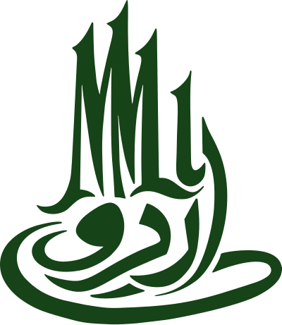

<p align="center">
  
</p>

<h1 align="center">UrduMMLU: A Massive Multitask Benchmark for Urdu Language Understanding</h1>

<p align="center">
  <b>Ahmer Tabassum</b><sup>*1</sup> &nbsp;·&nbsp;
  <b>Sarfraz Ahmad</b><sup>*1</sup> &nbsp;·&nbsp;
  <b>Hasan Iqbal</b><sup>*1</sup> &nbsp;·&nbsp;
  <b>Owais Aijaz</b><sup>1</sup> &nbsp;·&nbsp;
  <b>Momina Ahsan</b><sup>1</sup> &nbsp;·&nbsp;
  <b>Preslav Nakov</b><sup>1</sup>
</p>

<p align="center">
  <sup>1</sup> Mohamed bin Zayed University of Artificial Intelligence (MBZUAI) &nbsp;·&nbsp; <sup>*</sup>Equal contribution
</p>

<p align="center">
  <a href="https://arxiv.org/abs/2606.07167"></a>
  <a href="https://mbzuai-nlp.github.io/UrduMMLU/"></a>
  <a href="https://github.com/mbzuai-nlp/UrduMMLU"></a>
</p>

---

**UrduMMLU** is a large-scale, human-curated benchmark of **26,431** multiple-choice
questions written natively in Urdu. Questions are drawn from Pakistani secondary and
higher-secondary curricula (SSC-I through HSSC-II) and span the humanities, social
sciences, STEM, professional studies, and general knowledge.

Unlike machine-translated MMLU variants, every item here is sourced from native Urdu
exam material, then cleaned, de-duplicated, schema-normalized, and human-verified
through a multi-stage annotation pipeline.

## Dataset at a glance

|           |                                             |
| --------- | ------------------------------------------- |
| Questions | 26,431                                      |
| Language  | Urdu (`ur`)                                 |
| Format    | Single-answer multiple choice (4–5 options) |
| Levels    | SSC-I, SSC-II, HSSC-I, HSSC-II              |
| Domains   | 5 (26 subdomains)                           |
| Files     | `urdummlu.json`, `stats.json`               |

## Schema

Each record in `urdummlu.json` has exactly these fields:

```json
{
  "id": 0,
  "question": "لیوس ایسڈ۔ بیس ری ایکشن کی پروڈکٹ اڈکٹ میں کون سا بانڈ ہوتا ہے؟",
  "options": { "A": "کوویلنٹ بانڈ", "B": "کوآرڈینیٹ کوویلنٹ بانڈ", "C": "میٹلک بانڈ", "D": "آئیونک بانڈ" },
  "correct_key": "B",
  "domain": "STEM",
  "subdomain": "chemistry",
  "level": "SSC-II",
  "length_tier": "long",
  "source": [
    { "name": "BISE Multan 2025", "url": "https://www.bisemultan.edu.pk" }
  ]
}
```

Records are grouped by domain (STEM → Social Sciences → Humanities → Profession →
Other) and by subdomain frequency within each domain; `id` runs `0…N` in that order.

| Field         | Description                                              |
| ------------- | -------------------------------------------------------- |
| `id`          | Stable integer identifier                                |
| `question`    | Question stem in Urdu                                    |
| `options`     | Map of option key (`A`–`E`) to Urdu answer text          |
| `correct_key` | Key of the correct option                                |
| `domain`      | Top-level domain (one of 5)                              |
| `subdomain`   | Fine-grained subject (26 total)                          |
| `level`       | Curriculum level: `SSC-I`, `SSC-II`, `HSSC-I`, `HSSC-II` |
| `length_tier` | `short`, `long`, or `null` (question-length bucket)      |
| `source`      | List of `{name, url}` provenance entries                 |

## Domain distribution

| Domain          | Questions |
| --------------- | --------- |
| Humanities      | 11,010    |
| Social Sciences | 7,968     |
| STEM            | 5,113     |
| Other           | 1,365     |
| Profession      | 975       |

The 26 subdomains include Urdu literature, Urdu language, Islamic studies,
Pakistan studies, chemistry, biology, mathematics, computer science, economics,
sociology, and more. Per-subdomain, per-level, and source counts are in
[`stats.json`](stats.json).

## Curriculum levels

| Level   | Questions |
| ------- | --------- |
| SSC-I   | 11,601    |
| SSC-II  | 6,838     |
| HSSC-II | 4,125     |
| HSSC-I  | 3,867     |

## Usage

```python
from datasets import load_dataset

ds = load_dataset("MBZUAI/UrduMMLU", split="test")
ex = ds[0]
print(ex["question"])
print(ex["options"], "→", ex["correct_key"])
```

### Evaluation

Treat each item as a single-answer MCQ: present `question` and `options`, then
compare the model's chosen key against `correct_key`. Exact-match accuracy is the
primary metric. We recommend reporting accuracy broken down by `domain` and `level`.

## Sources

Questions were collected from publicly available Urdu exam and practice-question
repositories, including Ustad 360, MCQ Times, TestPoint PK, eTest, FBISE,
ExamAunty, GoTest, PakMCQs, and provincial examination boards (e.g. BISE Multan).
Each item retains its source attribution in the `source` field.

## Limitations

- Answer keys reflect the original source material and the annotation process;
  rare errors may remain.
- `length_tier` is `null` for items where a length bucket was not assigned.
- Coverage is weighted toward humanities and the SSC levels, mirroring the
  availability of native Urdu exam content.

## Citation

```bibtex
@misc{tabassum2026urdummlumassivemultitaskbenchmark,
      title={UrduMMLU: A Massive Multitask Benchmark for Urdu Language Understanding},
      author={Ahmer Tabassum and Sarfraz Ahmad and Hasan Iqbal and Owais Aijaz and Momina Ahsan and Preslav Nakov},
      year={2026},
      eprint={2606.07167},
      archivePrefix={arXiv},
      primaryClass={cs.CL},
      url={https://arxiv.org/abs/2606.07167},
}
```

## License

Released under [CC BY 4.0](https://creativecommons.org/licenses/by/4.0/).
